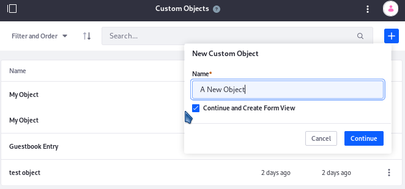
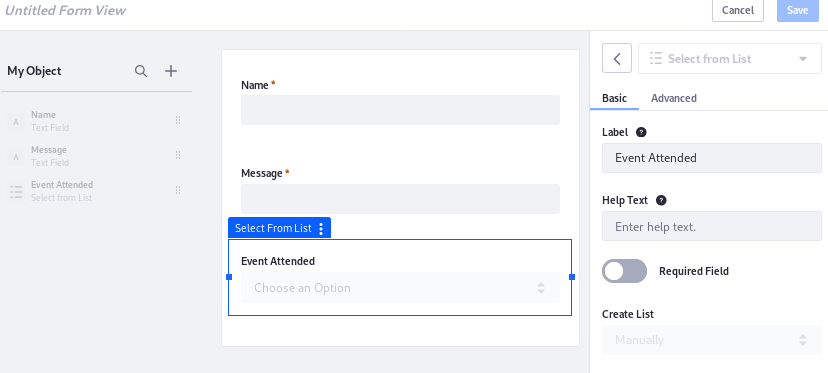
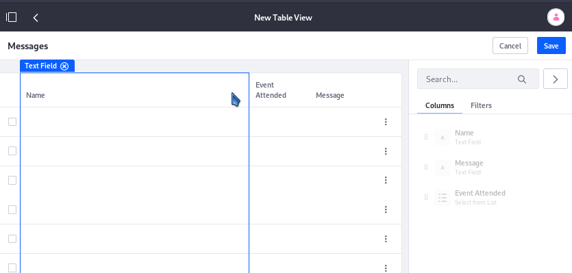

# Creating Applications with App Builder

Custom Objects are the foundation of your App Builder applications. They define all of the data fields that can be contained in the application. To create applications based on a custom object, you have three tasks: create at least one form view, create at least one table view, and deploy the application.

- [Creating a Custom Object](#creating-a-custom-object)

- [Creating Form Views](#creating-form-views)

- [Creating Table Views](#creating-table-views)

- [Deploying the Application](#deploying-the-application)

## Creating a Custom Object

To create custom objects, 

1.  Navigate to Control Panel &rarr; App Builder &rarr; Custom Objects, and click the add button.

2.  Enter a name for the object.

3.  To create a form view for the object and define the data fields present in the object, leave the _Continue and Create Form View_ setting checked and click _Continue_.

    

Define the data present in your Custom Object by creating a Form View.

## Creating Form Views

Once you're ready to define the data handled by your Custom Object, write as many Form Views as is needed for the application. The Form Views collect the fields of the Custom Object. They're populated by the application's Users filling out the forms they encounter.

1.  Open the Custom Object (Control Panel &rarr; App Builder &rarr; Custom Objects).

2.  From the _Form Views_ tab, click the Add button.

    The Form Builder is displayed.

    

Read [the article on the form builder](placeholder) to learn about all its features.

The form defines the data your custom object collects and provides the data collection interface for the app's users. To display the data, create a table view.

## Creating Table Views

Table views are for displaying the collected data. Like form views, a custom object can has one or multiple table views.

To create a table view, 

1.  Open the Custom Object (Control Panel &rarr; App Builder &rarr; Custom Objects).

2.  From the _Table Views_ tab, click the Add button.

    The Table Builder is displayed.

    

Read [the article on the table builder](placeholder) to learn about all its features.

## Deploying the Application

A custom object can have multiple applications. To create an application, select a single form view, a single table view, and configure the deployment options for the app. The deployment can be of three main types, and multiple deployment options can be used for a single app:

**Widget**
: Deploy the app to the widget menu, and add it to a page using the Add Widgets menu, from Add &rarr; Widgets &rarr; App Builder. When you deploy the app as a widget, you'll really be deploying three versions of the app:

1.  displays the table view by default but includes the Add button to access the form view
2.  only shows the table view
3.  only shows the form view

**Standalone**
: Deploy the app to a dedicated page that's not part of a site and not visible to any navigation menu. This limits access to only people with the link.

**Product Menu**
: Deploy the app to the Control Panel, the Site Menu, or both. This gives you flexibility in deciding where your app's administrative Users will access the app.
