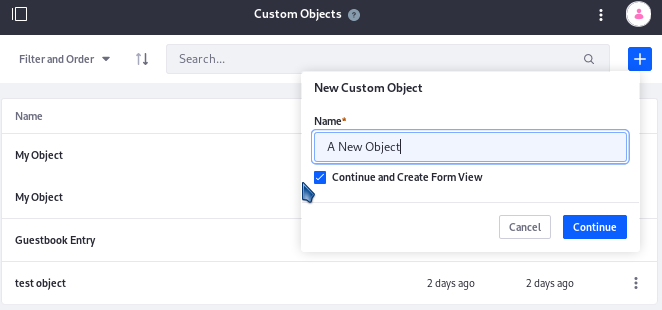
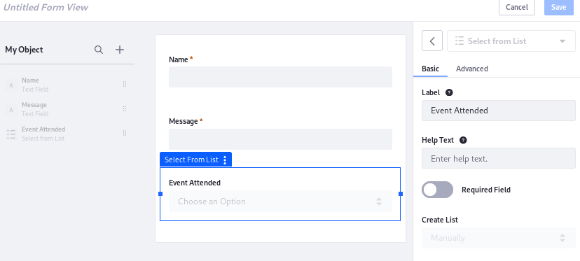
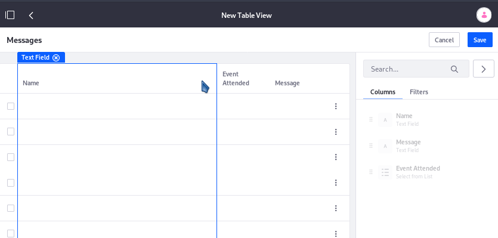

# Creating Applications with App Builder

Objects are the foundation of your App Builder applications. They define all of the data fields that can be contained in the application. To create applications based on an object, you have four tasks: create a custom object, create at least one form view, create at least one table view, and deploy the application.

- [Creating a custom object](#creating-a-custom-object)

- [Creating form views](#creating-form-views)

- [Creating table views](#creating-table-views)

- [Deploying the application](#deploying-the-application)

## Creating a Custom Object

To create custom objects, 

1.  Navigate to Control Panel &rarr; App Builder &rarr; Custom Objects, and click the add button.

1.  Enter a name for the object.

1.  To create a form view for the object and define the data fields present in the object, leave the _Continue and Create Form View_ setting checked and click _Continue_.

    

Define the data present in your custom object by creating a form view.

## Creating Form Views

Once you're ready to define the data handled by your custom object, write as many form views as is needed for the application. The form views collect the fields of the custom object. They're populated by the application's Users filling out the forms they encounter.

1.  Open the custom object (Control Panel &rarr; App Builder &rarr; Custom Objects).

1.  From the _Form Views_ tab, click the Add button.

    The Form Builder is displayed.

    

In addition to the embedded form builder, any fields include din the custom object (via the existence of other form views) are available to add to the form view in the left sidebar. Read [the article on the form builder](placeholder) to learn about all its features.

The form defines the data your custom object collects and provides the data collection interface for the app's users. To display the data, create a table view.

## Creating Table Views

Table views are for displaying the collected data. Like form views, a custom object can has one or multiple table views.

To create a table view, 

1.  Open the custom object (Control Panel &rarr; App Builder &rarr; Custom Objects).

1.  From the _Table Views_ tab, click the Add button.

    The Table Builder is displayed.

    

Read [the article on the table builder](placeholder) to learn about all its features.

## Deploying the Application

A custom object can have multiple applications. To create an application, select a single form view, a single table view, and configure the deployment options for the app. The deployment can be of three main types (described more fully in the introductory article):

1.  **Widget**

1.  **Standalone**

1.  **Product Menu**

Once your deployment options are defined, click Deploy. The app is live!
