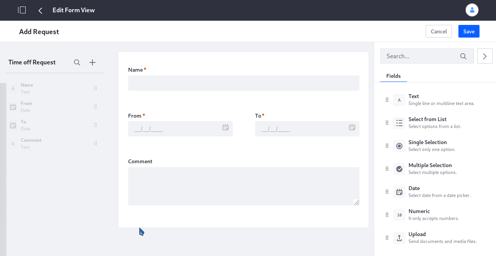
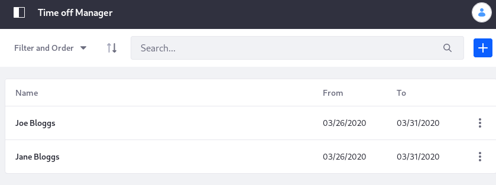
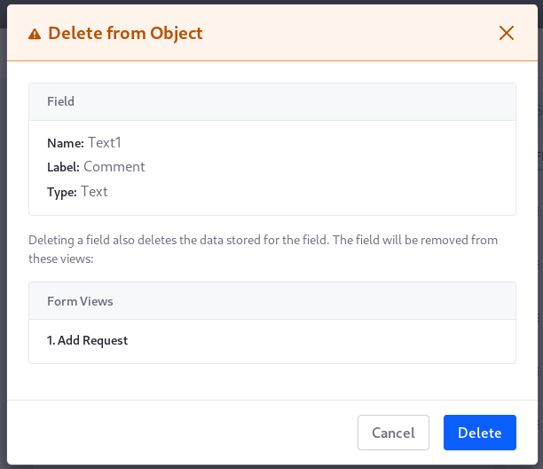
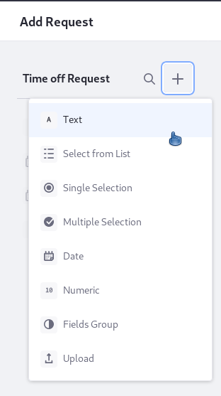
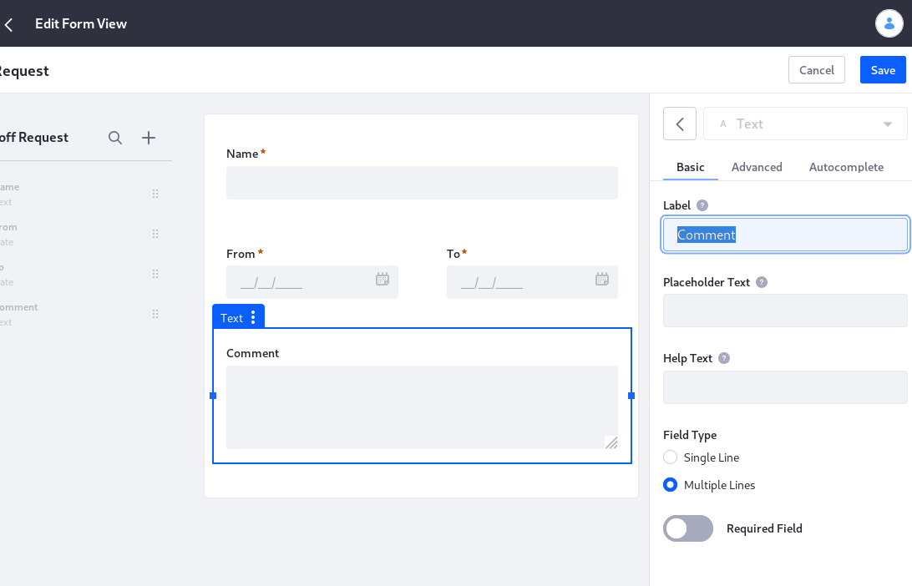

# Creating a Workflow Powered Application

Tried to start with a copy of the other article but it looks very different


To use Workflow Powered apps to their potential, make sure you understand these functionalities:

- [Roles and Permissions](../../users-and-permissions/roles-and-permissions/understanding-roles-and-permissions.md)
- [Workflow](../../process-automation/workflow/user-guide/introduction-to-workflow.md)
- [App Builder fundamentals](./app-builder-overview.md)

Follow the instructions in [Creating a Standard Application](./creating-a-standard-application.md) to create the object, form views, and table views for the app. Whether or not you've already created a Standard App, you can use the same object to create a Workflow Powered App. The difference is all in how you create the app from these elements. These instructions assume you already have these components:

A Standard app can be created from within the Object Control Panel entry, but not a Workflow Powered app. Instead use the _Apps_ Control Panel Entry:

1. Open the Applications Menu () and navigate to Control Panel &rarr; App Builder &rarr; Apps.

1. Click the _Workflow Powered_ tab. Any existing Workflow Powered apps are displayed. 

1. Click the Add button () to open the New Workflow Powered App canvas.

   

1. The first step of the workflow is in place, just rename it to _Submitted_.

1. Add a step to the workflow by clicking the plus icon. Often times each step you add will correspond to a different form. Together, all the steps/forms will fill out all the fields of the backing object.

1. Each step of the workflow 


Like all App Builder apps, Workflow Powered Apps are created based on an object: create the object, create at least one form view, create at least one table view, and deploy the application.

* [Creating a Custom Object](#creating-a-custom-object)
* [Creating Form Views](#creating-form-views)
* [Creating Table Views](#creating-table-views)
* [Deploying the Application](#deploying-the-application)

Here we'll create two simple time off management applications with App Builder, backed by a custom object called Time Off Request. The first application will be a Time Off Requester widget that just shows an Add Request form. The application's users will fill out this form when they want to request time off. The second application is a Time Off Management application deployed to the Product Menu, where administrative Users can see and manage the Time Off Requests.

## Creating a Custom Object

Create the Time Off Request custom object:

1. Open the Applications Menu () and navigate to Control Panel &rarr; App Builder &rarr; Custom Objects.

1. Click the add button ().

1. Enter the name: _Time Off Request_.

1. To create a form view for the object and define the data fields present in the object, leave the _Continue and Create Form View_ setting checked and click _Continue_.

    

Define the data fields to include in the Time Off Request object by creating a form view.

## Creating Form Views

A form view defines the visual interface that users will use to enter the data you define in your Custom Object. You may create as many form views as needed for your application. In this example, the Time Off Requester and Manager applications only need one form view between them.

Create a Form View:

1. Open the custom object (Control Panel &rarr; App Builder &rarr; Custom Objects).

1. From the _Form Views_ tab, click the Add button. The Form Builder is displayed.

1. Name the form view _Add Request_.

1. Using the layout in the screenshot, add

    * a required text field labeled _Name_
    * a required date field labeled _From_
    * a required date field labeled _To_
    * an optional text field labeled _Comment_, which allows multiple lines

1. Save the form view.

    

In addition to the embedded form builder, any fields included in the custom object (via the existence of other form views) are available to add to the form view in the left sidebar.

To define how users will view and interact with your application's data, create a table view.

## Creating Table Views

Table views are for displaying and managing (deleting, editing) entries that have been submitted to your application. Like form views, a custom object can have one or multiple table views. The Time Off Requester and Manager applications only need one table view between them.

1. Open the Time Off Request object (Control Panel &rarr; App Builder &rarr; Custom Objects).

1. From the Table Views tab, click the Add button. The Table Builder is displayed.

    

1. Name the table view _Time Off Requests_.

1. Drag all the available fields except for the Comment field onto the table canvas.

1. Save the table view.

```note::
    Even though it's not in the table view, the Comment field is still visible in the Details View of an individual record. In a deployed application, click on a specific record from the table view to display the Details View of the record.
```

## Deploying the Application

Deploying an application is what makes it accessible to users. There are several ways you can make your application available to users. See the [App Builder Overview](./app-builder-overview.md#deployment) learn about the deployment options.

We will deploy two applications for the Time Off Request object: one is a widget application that we can add to a site page for users to access, and the other is an administrative application in the [Product Menu](../../getting-started/navigating-dxp.md#product-menu), where the request can be managed by users with additional permissions.

1. Open the Time Off Request (Control Panel &rarr; App Builder &rarr; Custom Objects).

1. From the _Apps_ tab, click the Add button ().

1. Name the app _Time Off Requester_.

1. Select the form view, the table view, and configure the [deployment options](./app-builder-overview.md#deployment) for the app.

    For the _Time Off Requester_ application, select _Widget_ and click Deploy. The _Time Off Requester_ widget application can now be deployed to a site's page and utilized immediately by site users.

1. Following the same procedure, create a second app called _Time Off Request Manager_, this time choosing to deploy the app in the Product Menu (leave the defaul selection to add it to the Applications Menu).

    
<!-- replace above screenshot -->

Administrators can now access the _Time Off Manager_ application in the Product Menu to begin monitoring time off requests from site users.

## Undeploying an Application

You can undeploy and redeploy App Builder applications at any time (e.g., if a new set of time off management applications are created). If you undeploy an application, any entries already submitted are preserved, but no new entries can be added. To undeploy,

1. Open the custom object (Control Panel &rarr; App Builder &rarr; Custom Objects).

1. From the _Apps_ tab, click the kebab menu for the app you want to undeploy.

1. Select _Undeploy_.

## Editing an Object with Data Records

The App Builder is designed to prevent data corruption or loss. Deleting, adding, or editing a field, even after data records have been added for it, is permitted.

### Deleting Fields

Deleting a field from an object that already has data records prevents the field from display in the UI, but doesn't delete the data. If you create a field with same name and type as a deleted field, the field's data will be restored for records that already hold its data.

To remove a field from an existing object, hover over it in the object view and click the *x*. You'll be asked for confirmation and warned about data loss.



### Adding and Editing Fields

When you add or edit a field already being used in an object, the changes to the object will only affect records added after the add or edit. All existing records remain unaffected by the change to the object.

To add a field directly to an existing object, open the any of the object's form views and click the add button in the left pane of the form builder.



To edit a field, navigate to the form view where it exists and click the field in the form builder. The field properties will open.



## Related Information

* [App Builder Overview](./app-builder-overview.md)
* [Creating a Workflow Powered App](./creating-a-workflow-powered-app.md)
